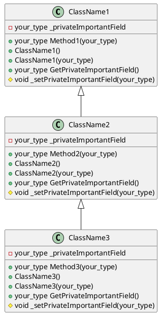

<ol class="breadcrumb">
  <li class="breadcrumb-item"><a href="{{ site.baseurl }}">Главная</a></li>
  <li class="breadcrumb-item"><a href="{{ site.baseurl }}/OOP/index.html">ООП</a></li>
  <li class="breadcrumb-item active">ЛР №1</li>
</ol>

# Классы, объекты, инкапсуляция, наследование

Дана UML диаграмма классов. У каждого класса есть приватное поле (`privateImportantField`), конструктор без параметров и один перегруженный конструктор с параметром, значение которого передается в упомянутое поле.

Необходимо придумать **осмысленные** поле и метод для каждого из классов (осмысленные и для его наследников). По желанию можно сделать классы более конкретными.

В прошлой лабораторной вы уже реализовывали функциональность, предоставляемую ClassName2 (или, как минимум, ClassName1). Теперь нужно посмотреть на это с точки зрения объектов.






<div class="card border-primary mb-2" style="max-width: 60rem;">
  <div class="card-body">
    
  </div>
</div>









``` csharp
class ClassName1 {
  private your_type _privateImportantField;
  public your_type Method1(your_type param0) {
      return null;
  }
  public void ClassName1() {
  }
  public void ClassName1(your_type param0) {
  }
  public your_type GetPrivateImportantField() {
      return null;
  }
  public void _setPrivateImportantField(your_type param0) {
  }
}

class ClassName2 : ClassName1 {
  private your_type _privateImportantField;
  public your_type Method2(your_type param0) {
      return null;
  }
  public void ClassName2() {
  }
  public void ClassName2(your_type param0) {
  }
  public your_type GetPrivateImportantField() {
      return null;
  }
  public void _setPrivateImportantField(your_type param0) {
  }
}

class ClassName3 : ClassName2 {
  private your_type _privateImportantField;
  public your_type Method3(your_type param0) {
      return null;
  }
  public void ClassName3() {
  }
  public void ClassName3(your_type param0) {
  }
  public your_type GetPrivateImportantField() {
      return null;
  }
  public void _setPrivateImportantField(your_type param0) {
  }
}
```




Из описания диаграммы классов в нотации PlantUML можно сгенерировать шаблон кода на C# с помощью открытого проекта с гитхаба [plantuml-code-generator](https://github.com/bafolts/plantcode){:target="_blank"} - пример того, что получится, на 3-й вкладке выше.

Можно сгенерировать UML диаграмму классов из готового кода C# следующими методами:
* Конструктор классов в Microsoft Visual Studio ([Class Designer](https://learn.microsoft.com/en-us/visualstudio/ide/class-designer/designing-and-viewing-classes-and-types?view=vs-2022){:target="_blank"}). Необходимо:
  * Microsoft Visual Studio
  * (плюсы) связано с кодом сборки, можно проектировать, рефакторить и просматривать классы
  * (минусы) видит только связи наследования (+ ассоциация)
* Doxigen
  * (плюсы) у вас есть документация
  * (минусы) видит только связи наследования (+ ассоциация)
* Расширение для Visual Studio Code [CSharp to PlantUML](https://marketplace.visualstudio.com/items?itemName=pierre3.csharp-to-plantuml){:target="_blank"}. Необходимо:
  * Visual Studio Code
  * Dotnet SDK
  * PlantUML
  * (плюсы) хорошее начало для редактирования
  * (минусы) отображает агрегацию как ассоциацию, а реализацию как наследование

# Задание

## Приемлемо

1. Спроектировать программу - в диаграмме классов из примера изменить согласно варианту названия классов, полей и методов. Использовать один из следующих способов:
  * Скачать [файл]({{ site.baseurl }}/img/uml1.svg), открыть в [draw.io](https://app.diagrams.net/){:target="_blank"}, внести изменения.
  * Скопировать код PlantUML из 2-й вкладки выше, редактировать диаграмму в [plantuml.com](https://www.plantuml.com/plantuml/uml/SyfFKj2rKt3CoKnELR1Io4ZDoSa70000){:target="_blank"}.
2. Реализовать иерархию классов в коде. Геттер и сеттер для приватного поля реализовать:
  * для ClassName1 через методы (как на диаграмме);
  * для ClassName2 через [свойство](https://metanit.com/sharp/tutorial/3.4.php);
  * для ClassName3 через [автосвойство](https://metanit.com/sharp/tutorial/3.4.php).
3. В основном теле программы создать экземпляры классов разными способами, продемонстрировать доступные и недоступные способы работы с ними.
4. Если вы пропустили пункт 1., сгенерировать диаграмму классов из кода.

___

## Выше ожидаемого

* Использовать в методах значения полей родительских классов.
* Перегрузить в классах наследниках методы родительских классов.

___

## Превосходно

Осмысленно перегрузить для ClassName3 операторы:
* `+`
* `>` и `<`
* `==` и `!=`
* `++`

<div class="table-responsive">
<table class="table table-hover border-primary  table-bordered">
  <thead>
    <tr class="table-dark">
      <th scope="col">№ варианта</th>
      <th scope="col">ClassName1</th>
      <th scope="col">ClassName2</th>
      <th scope="col">ClassName3</th>
    </tr>
  </thead>
  <tbody>
    <tr>
      <th scope="row">1</th>
      <td>Сортировка</td>
      <td>Простая (квадратичная) сортировка $O(n^2)$</td>
      <td>Сортировка пузырьком</td>
    </tr>
    <tr>
      <th scope="row">2</th>
      <td>Веб-сервис</td>
      <td>Сервис прогноза погоды</td>
      <td>Gismeteo</td>
    </tr>
    <tr>
      <th scope="row">3</th>
      <td>Элемент графического интерфейса</td>
      <td>Виджет</td>
      <td>TextBox</td>
    </tr>
    <tr>
      <th scope="row">4</th>
      <td>Компилятор</td>
      <td>Компилятор для языка Си</td>
      <td>GCC</td>
    </tr>
    <tr>
      <th scope="row">5</th>
      <td>Игровой движок</td>
      <td>Шахматный движок</td>
      <td>Stockfish</td>
    </tr>
    <tr>
      <th scope="row">6</th>
      <td>Коллекция объектов</td>
      <td>Список</td>
      <td>Двусвязный список</td>
    </tr>
    <tr>
      <th scope="row">7</th>
      <td>Веб-сервис</td>
      <td>Сервис прогноза погоды</td>
      <td>wttr.in</td>
    </tr>
    <tr>
      <th scope="row">8</th>
      <td>Коллекция объектов</td>
      <td>Список</td>
      <td>Кольцевой список</td>
    </tr>
    <tr>
      <th scope="row">9</th>
      <td>Элемент графического интерфейса</td>
      <td>Виджет</td>
      <td>Кнопка</td>
    </tr>
    <tr>
      <th scope="row">10</th>
      <td>Компилятор</td>
      <td>Компилятор для языка C#</td>
      <td>csc.exe</td>
    </tr>
    <tr>
      <th scope="row">11</th>
      <td>Сортировка</td>
      <td>Сложная сортировка $O(n \log n)$</td>
      <td>Быстрая сортировка</td>
    </tr>
    <tr>
      <th scope="row">12</th>
      <td>Генератор</td>
      <td>Генератор случайных чисел</td>
      <td>Генератор случайных чисел с нормальным распределением</td>
    </tr>
   </tbody>
</table>
</div>


<div class="row">
  <div class="col-lg-12">
   <ul class="list-unstyled">
     <li class="float-end">
       <button type="button" class="btn btn-outline-primary" onclick="window.location.href='#задание';">Вверх</button>
     </li>
     <li  class="float-end">
       <button type="button" class="btn btn-primary" onclick="window.location.href='{{ site.baseurl }}/OOP/labs/lab2.html';">ЛР №2 →</button>
     </li>
     <li>
       <button type="button" class="btn btn-primary" onclick="window.location.href='{{ site.baseurl }}/OOP/labs/lab0.html';">← ЛР №0</button>
     </li>
   </ul>
  </div>
</div>