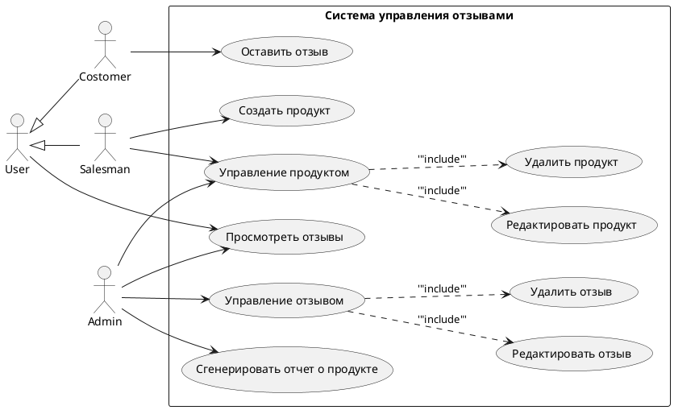
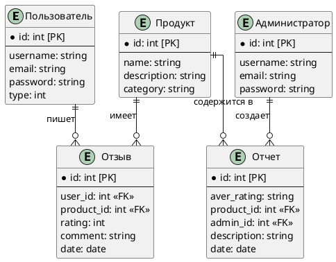
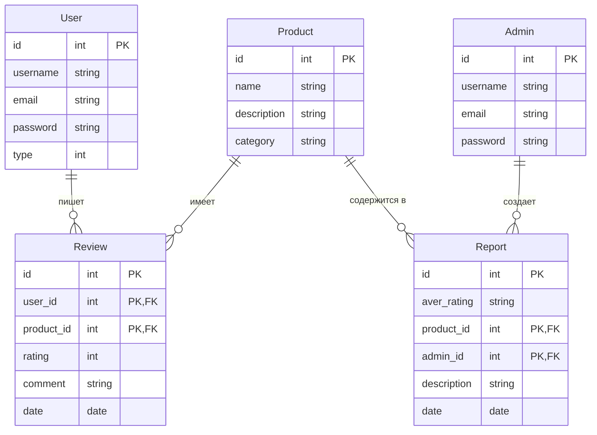
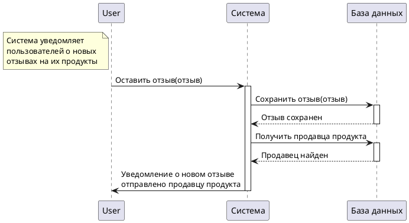
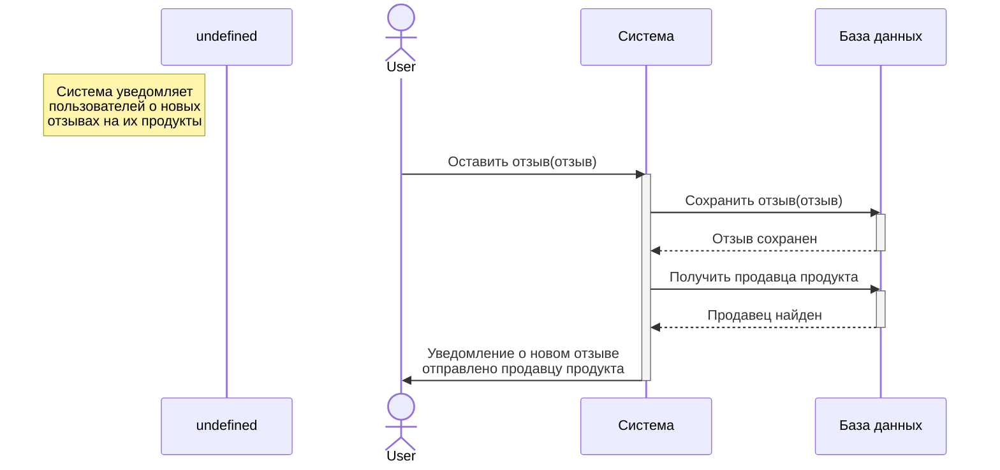

<ol class="breadcrumb">
  <li class="breadcrumb-item"><a href="{{ site.baseurl }}">Главная</a></li>
  <li class="breadcrumb-item"><a href="{{ site.baseurl }}/TIPiS/index.html">ТИПиС</a></li>
  <li class="breadcrumb-item active">ЛР №11</li>
</ol>

<nav>
  <ul></ul>
</nav>

# Инженерия требований

При проектировании нового приложения или поддержке старого, необходимо опираться на различные требования к вашей системе.

Про требования и какие они бывают написано в [этой](https://dzen.ru/a/ZA85IijE9wSQj-4G){:target="_blank"} статье.
Нас интересуют *требования пользователей (user requirements)* и *функциональные требования (functional requirements)*. Первые ближе к предметной области и ожиданиям пользователей, и отражают ограничения доступа. Вторые про то, как должна быть устроена программа.

**Диаграмма вариантов использования** (англ. **use-case diagram**) – диаграмма, описывающая, какой функционал разрабатываемой программной системы доступен каждой группе пользователей. Можно почитать статью с примерами [здесь](https://habr.com/ru/articles/566218/){:target="_blank"}.

**Диаграмма последовательности** используется для визуализации взаимодействия между объектами в системе. Она показывает порядок сообщений, которыми объекты обмениваются друг с другом во времени, и их жизненный цикл. Можно почитать статью с примерами [здесь](https://habr.com/ru/articles/814769/){:target="_blank"}.

Требования не обязательно описывают полную функциональность системы, некоторые моменты нужно додумывать, опираясь на существующие требования.
Например, какие данные мы хотим видеть у пользователя в такси, какие свойства и данные могут иметь продукты в магазине.
Самое главное, чтобы это отражало бизнес-задачу, поставленную перед вами.

Освежить память про нотации **модели сущность-связь (ER диаграммы)** для построения БД можно [здесь](https://pro-prof.com/archives/8126){:target="_blank"}.

Создавать диаграммы можно несколькими способами:
* Drag-and-drop, например, [draw.io](https://app.diagrams.net/).
* С помощью кода на сайтах или с плагинами локально в редакторах кода:
  * PlantUML, например [здесь](https://www.plantuml.com/plantuml/uml/SyfFKj2rKt3CoKnELR1Io4ZDoSa70000){:target="_blank"};
  * Mermaind [здесь](https://mermaid.live){:target="_blank"}.

## Задание 🍰

По пользовательским требованиям, описанным в вашем варианте:
1. Определить атомарные функциональные требования к системе (**минимум 10 шт.**)
1. Спроектировать базу данных.
2. Создать диаграмму вариантов использования (Use Case).
3. Написать 3 диаграммы последовательности (или 2, если будет использоваться группировка).

<table class="table table-hover border-primary table-bordered">
  <thead>
    <tr class="table-dark">
      <th scope="col">№ варианта</th>
      <th scope="col">Тема</th>
      <th scope="col">Пользовательские требования</th>
    </tr>
  </thead>
  <tbody>
    <tr>
      <th scope="row">1</th>
      <td>Система управления задачами</td>
      <td>1. Администраторы могут просматривать все задачи. 
        2. Пользователи могут назначать задачи другим пользователям, просмотривать свои задачи, оставлять комментарии к задачам, на которые назначены. 
        3. Система должна отправлять уведомления о изменении статуса задачи ("недоступно", "в работе", "завершено") только пользователям, связанным с задачей.</td>
    </tr>
    <tr>
      <th scope="row">2</th>
      <td>Система управления бронированием отелей</td>
      <td>1. Гости могут создавать и отменять бронирования, просматривать свои бронирования и доступные номера. Гостям доступны услуги, которые могут быть добавлены к их бронированию. 
      2. Персонал может проверять наличие свободных номеров и управлять только теми бронированиями, которые были сделаны через их учетные записи. 
      3. Система должна хранить информацию о доступных номерах и их состоянии, уведомлять гостей об изменениях в статусе их бронирования. </td>
    </tr>
    <tr>
      <th scope="row">3</th>
      <td>Система управления проектами</td>
      <td>1. Пользователи могут создавать и редактировать свои проекты, изменять их статус ("планируется", "в процессе", "завершен"), добавлять задачи к проектам, назначать роли в проекте (например, участник, наблюдатель). Пользователи могут добавлять комментарии к проектам, но только участники могут редактировать их. 
      2. Администраторы могут видеть все проекты и задачи. 
      3. Система должна сохранять историю изменений проектов и задач и оправлять уведомления о статусах проектов участникам проекта.</td>
    </tr>
    <tr>
      <th scope="row">4</th>
      <td>Система управления медицинскими записями</td>
      <td>1. Врачи могут добавлять и редактировать медицинские записи своих пациентов, назначать лекарства и процедуры. 
      2. Пациенты могут просматривать свои медицинские записи, оставлять отзывы о посещениях, запрашивать изменения в своих записях через врачей. 
      3. Система должна хранить историю посещений пациентов, отправлять уведомления о новых записях и изменениях врачам и пациентам.</td>
    </tr>
    <tr>
      <th scope="row">5</th>
      <td>Система управления запасами в магазине</td>
      <td>1. Сотрудники могут добавлять, удалять товары из инвентаря и видеть только товары, которые они добавили или редактировали, генерировать отчеты о запасах. 
      2. Администраторы могут управлять всеми товарами и категориями. 
      3. Система должна хранить информацию о поставщиках и категориях товаров и уведомлять сотрудников о низком уровне запасов.</td>
    </tr>
    <tr>
      <th scope="row">6</th>
      <td>Система управления онлайн-курсами</td>
      <td>1. Студенты могут регистрироваться на курсы, видеть свои оценки, оставлять отзывы о курсах. 
      2. Преподаватели могут добавлять материалы, задания и просматривать результаты студентов для курсов, к которым преподаватели назначены. 
      3. Система должна хранить результаты экзаменов и заданий и отправлять уведомления студентам о новых заданиях и оценках.</td>
    </tr>
    <tr>
      <th scope="row">7</th>
      <td>Система управления финансами</td>
      <td>1. Пользователи могут создавать цели (например, накопления на отпуск), отслеживать их выполнение и делиться своими целями с друзьями, добавлять и редактировать свои финансовые транзакции,. 
      2. Система должна отслеживать категории расходов и доходов, генерировать отчеты о финансах, уведомлять пользователей о превышении бюджета (расходов над доходами).</td>
    </tr>
    <tr>
      <th scope="row">8</th>
      <td>Система учета клиентов для CRM</td>
      <td>1. Менеджеры могут добавлять и редактировать информацию о своих клиентах, создавать сделки и управлять своими сделками, генерировать отчеты по клиентам и сделкам, делиться заметками о клиентах. 
      2. Система должна хранить информацию о планируемых встречах и звонках, отслеживать взаимодействия с клиентами, уведомлять менеджеров о предстоящих встречах.</td>
    </tr>
    <tr>
      <th scope="row">9</th>
      <td>Система управления спортивными мероприятиями</td>
      <td>1. Организаторы могут создавать мероприятия, просматривать, добавлять и редактировать информацию о свои мероприятиях, просматривать статистику участников своих мероприятий. 
      2. Участники могут регистрироваться на мероприятия, оставлять отзывы о мероприятиях, просматривать подробную информацию только по тем мероприятиям, на которые они зарегистрированы. 
      3. Система должна хранить информацию о результатах мероприятий и отправлять уведомления участникам о предстоящих мероприятиях.</td>
    </tr>
    <tr>
      <th scope="row">10</th>
      <td>Система управления доставкой</td>
      <td>1. Клиенты могут заказывать доставку товаров, просматривать свои заказы и их статусы, оставлять отзывы о доставке. 
      2. Курьеры могут принимать заказы и изменять статус их выполнения. 
      3. Система должна хранить информацию о клиентах и заказах, генерировать отчеты о доставленных заказах, отправлять уведомления клиентам о статусах заказов. </td>
    </tr>
    <tr>
      <th scope="row">11</th>
      <td>Система управления библиотекой</td>
      <td>1. Пользователи могут просматривать доступные книги и авторов и заказывать выдачу книги на определенный срок. 
      2. Система должна отслеживать статус книг (доступно, занято) и уведомлять пользователей о предстоящем окончании срока возврата книг. 
      3. Библиотекари могут управлять всеми книгами и пользователями, генерировать отчеты о книгах и пользователях. </td>
    </tr>
    <tr>
      <th scope="row">12</th>
      <td>Система управления подписками на сервисы</td>
      <td>1. Администраторы могут управлять списком доступных сервисов для подписки. 
      2. Пользователи могут видеть свои активные и прошлые подписки на различные сервисы (например, потоковые сервисы, новости), могут подписываться и отменять свои подписки в любое время. 
      3. Система должна хранить информацию о подписках, включая дату начала и окончания, и напоминать пользователям о продлении подписки перед ее окончанием. </td>
    </tr>
   </tbody>
</table>

## Пример: Система управления отзывами о продуктах

Даны **пользовательские требования:**
1. Покупатели могут оставлять отзывы к продуктам.
1. Все пользователи могут читать отзывы всех покупателей на всех продуктах.
1. Продавцы могут управлять своими продуктами и получать уведомления о новых отзывах на свои продукты.
2. Администраторы могут управлять всеми продуктами, отзывами к ним и генерировать отчеты о средних оценках продуктов.

Из них получаем следующие **функциональные требования:**
1. Продавцы могут создавать свои продукты в системе.
1. Продавцы могут редактировать свои продукты в системе.
1. Продавцы могут удалять свои продукты из системы.
1. Покупатели могут оставлять отзывы о продуктах.
1. Пользователи могут видеть отзывы других пользователей.
1. Система должна хранить информацию о продуктах, пользователях и их отзывах.
1. Администраторы могут редактировать или удалять продукты.
1. Администраторы могут редактировать или удалять отзывы.
1. Система должна генерировать отчеты о средних оценках продуктов.
1. Система должна уведомлять продавцов о новых отзывах к их продуктам.

### 1. Диаграмма Use Case





  

    
  









### 2. База данных





  

    
  













  

    
  





### 3. Диаграммы последовательности

  

    
  

  

    
  





  

    
  













  

    
  





  

   <ul class="list-unstyled">
     <li class="float-end">
       <button type="button" class="btn btn-outline-primary" onclick="window.location.href='#инженерия-требований';">Вверх</button>
     </li>
     <li  class="float-end">
       <button type="button" class="btn btn-primary" onclick="window.location.href='{{ site.baseurl }}/TIPiS/labs/lab12.html';">ЛР №12 →</button>
     </li>
     <li>
       <button type="button" class="btn btn-primary" onclick="window.location.href='{{ site.baseurl }}/TIPiS/labs/lab10.html';">← ЛР №10</button>
     </li>
   </ul>
  

